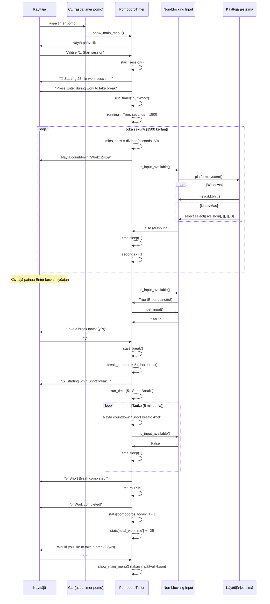

```mermaid
sequenceDiagram
    participant User as Käyttäjä
    participant CLI as CLI (aspa timer pomo)
    participant Timer as PomodoroTimer
    participant Input as Non-blocking Input
    participant OS as Käyttöjärjestelmä

    User->>CLI: aspa timer pomo
    CLI->>Timer: show_main_menu()
    Timer->>User: Näytä päävalikko
    User->>Timer: Valitse "1. Start session"

    Timer->>Timer: start_session()
    Timer->>User: "🍅 Starting 25min work session..."
    Timer->>User: "Press Enter during work to take break"

    Timer->>Timer: run_timer(25, "Work")
    Timer->>Timer: running = True, seconds = 1500

    loop Joka sekunti (1500 kertaa)
        Timer->>Timer: mins, secs = divmod(seconds, 60)
        Timer->>User: Näytä countdown "Work: 24:59"

        Timer->>Input: is_input_available()
        Input->>OS: platform.system()

        alt Windows
            OS->>Input: msvcrt.kbhit()
        else Linux/Mac
            OS->>Input: select.select([sys.stdin], [], [], 0)
        end

        Input->>Timer: False (ei inputia)
        Timer->>Timer: time.sleep(1)
        Timer->>Timer: seconds -= 1
    end

    Note over User: Käyttäjä painaa Enter kesken työajan

    Timer->>Input: is_input_available()
    Input->>Timer: True (Enter painettu!)

    Timer->>Input: get_input()
    Input->>Timer: '\r' tai '\n'

    Timer->>User: "Take a break now? (y/N)"
    User->>Timer: "y"

    Timer->>Timer: _start_break()
    Timer->>Timer: break_duration = 5 (short break)
    Timer->>User: "☕ Starting 5min Short break..."

    Timer->>Timer: run_timer(5, "Short Break")

    loop Tauko (5 minuuttia)
        Timer->>Timer: Näytä countdown "Short Break: 4:59"
        Timer->>Input: is_input_available()
        Input->>Timer: False
        Timer->>Timer: time.sleep(1)
    end

    Timer->>User: "✅ Short Break completed!"
    Timer->>Timer: return True

    Timer->>User: "✅ Work completed!"
    Timer->>Timer: stats['pomodoros_today'] += 1
    Timer->>Timer: stats['total_worktime'] += 25

    Timer->>User: "Would you like to take a break? (y/N)"
    User->>Timer: "n"

    Timer->>Timer: show_main_menu() (takaisin päävalikkoon)
```
